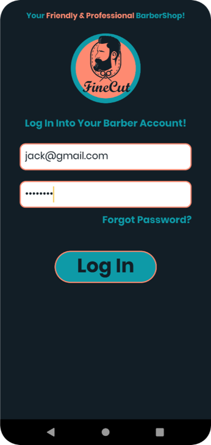
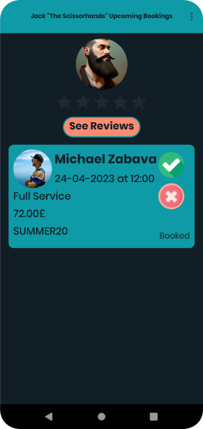
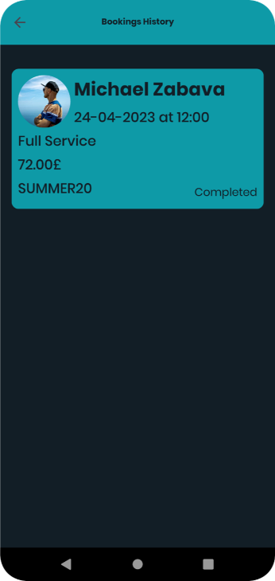
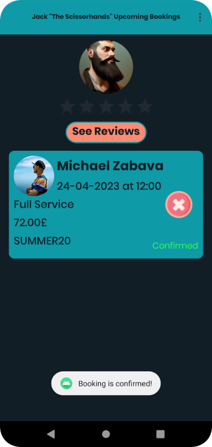
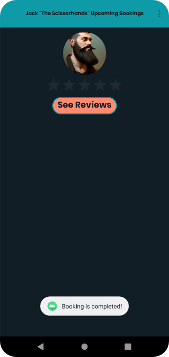

# <h1 align="center">Barber-Booking-Manager</h1>

<h3 align="left">With the help of this app, barbers can manage their appointments in real time. (Accept, Cancel, Decline)</h3>

<h4 align="left">Main Futures:</h4>

- Barber Login
- Barbers can Accept, Decline or Cancel appointments
- Barbers can see booking and customer information
- Barbers can see their reviews
- Barbers can see their appointment history

<h4 align="left">Application Screenshots:</h4>

- Barber Login Screen

- Home Screen

- Logged In With Another Barber Account

- Booking Details Screen

- Booking History Screen

- Booking Accepted

- Booking Decline

- Booking Completed

- Barber Reviews Screen

<h4 align="left">All screenshots where made on a Pixel 6 with Anrdoid 13 and on a Pixel 4 with Android 12 (Virtual Devices)</h4>
